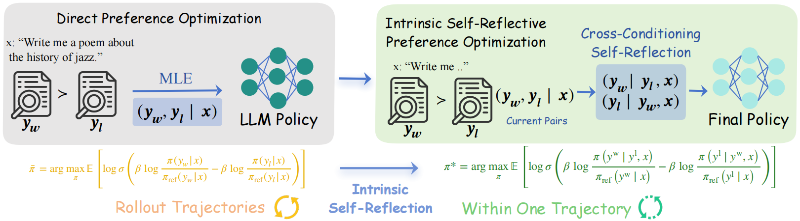

# 🚀 INSPO 🚀

**Official implementation of INSPO**

INSPO : Unlocking Intrinsic Self-Reflection for LLM Preference Optimization

## 🌼 Abstract

Direct Preference Optimization (DPO) and its variants have become the standard for aligning Large Language Models (LLMs). 
However, we identify two fundamental limitations. First, the optimized policy lacks invariance since it varies with modeling choices such as scalarization function or reference policy, whereas an optimal policy should remain invariant. Second, most existing methods yield theoretically suboptimal policies by not fully exploiting the comparative information in pairwise preference data, thus missing an opportunity for self-reflection through comparing and contrasting responses.

To address both limitations, we propose Intrinsic Self-reflective Preference Optimization (InSPO), which derives a globally optimal policy conditioned on both context and alternative response, explicitly formalizing self-reflection. We prove this formulation surpasses standard DPO and RLHF targets while guaranteeing invariance.
InSPO serves as a plug-and-play enhancement for DPO-family algorithms, decoupling alignment from modeling constraints without architectural changes. Using privileged information learning, InSPO requires no alternative response at inference since the self-reflective mechanism is distilled during training, incurring zero overhead. Experiments show InSPO consistently improves win rates and length-controlled metrics across DPO variants, yielding more robust and human-aligned LLMs.



## 🎯 Key Features

- **Intrinsic Self-Reflection**: Explicitly formalizes self-reflection by conditioning on both context and alternative response
- **Invariance Guarantee**: Ensures optimal policy remains invariant to modeling choices
- **Plug-and-Play Enhancement**: Works seamlessly with DPO-family algorithms without architectural changes
- **Zero Inference Overhead**: Self-reflective mechanism is distilled during training, requiring no alternative response at inference

## 📁 Project Structure

```
InsPO/
├── openrlhf/
│   ├── cli/
│   │   ├── train_dpo.py
│   │   └── ...
│   └── ...
├── shell/
│   ├── dpo_llama.sh
│   ├── dpo_gemma.sh
│   ├── dpo_mistral.sh

├── checkpoint/
├── prefer/
│   └── data/
└── ...
```

## 🛠️ Installation

This implementation is built on top of [OpenRLHF](https://github.com/OpenRLHF/OpenRLHF). We recommend using conda to manage the environment.

### Installation Steps

```bash
git clone <repository-url>
cd InsPO

conda create -n handbook python=3.10 -y
conda activate handbook

conda install pytorch torchvision torchaudio pytorch-cuda=11.8 -c pytorch -c nvidia -y

pip install -r requirements.txt

pip install flash-attn==2.8.3 --no-build-isolation

pip install -e .

pip install openrlhf[vllm]

python -c "import openrlhf; print(openrlhf.__version__)"
```

**Key Dependencies:**
- `deepspeed==0.17.4` - Distributed training
- `transformers==4.55.2` - HuggingFace transformers
- `flash-attn==2.8.3` - Flash Attention (requires CUDA)
- `ray[default]==2.48.0` - Distributed computing
- `accelerate`, `datasets`, `wandb`, `bitsandbytes`, `peft` - Additional utilities

**Note:** If your conda environment already has some packages installed, you may need to use `--upgrade` flag or adjust versions accordingly.


## 📊 Dataset Configuration

### Training Dataset: UltraFeedback

We use the **UltraFeedback** dataset from [HuggingFace](https://huggingface.co/datasets/openbmb/UltraFeedback) for training. UltraFeedback contains 63,967 instructions sampled from 6 high-quality datasets (Evol-Instruct, UltraChat, ShareGPT, Flan, TruthfulQA, FalseQA), with completions from 17 different models and annotations based on 5 alignment principles (Helpfulness, Truthfulness, Honesty, Verbalized Calibration, Harmless).

**Dataset Source:**
- **HuggingFace Dataset**: [`openbmb/UltraFeedback`](https://huggingface.co/datasets/openbmb/UltraFeedback)

**Configure the Dataset:**

1. **Download UltraFeedback from HuggingFace:**
   ```bash
   python -c "from datasets import load_dataset; ds = load_dataset('openbmb/UltraFeedback'); ds.save_to_disk('./ultrafeedback')"
   ```

2. **Convert to DPO format:**
   ```bash
   cd prefer
   python preprocess_ultrafeedback.py
   ```
   This preprocessing script converts the UltraFeedback dataset into DPO format (JSONL) with `prompt`, `chosen`, and `rejected` fields.

3. **Use the processed dataset:**
   After preprocessing, the DPO-formatted dataset will be available at:
   ```bash
   DATASET_PATH="./prefer/data/ultrafeedback_dpo.jsonl"
   ```
   Or for Princeton Llama3-UltraFeedback-ArmoRM variant:
   ```bash
   DATASET_PATH="./prefer/data/Princeton_llama3_ultrafeedback_armorm_dpo.jsonl"
   ```

**Dataset Format:**
The processed dataset follows the standard DPO format (JSONL):
```json
{
  "prompt": "User question here",
  "chosen": "Preferred response",
  "rejected": "Less preferred response"
}
```

### Evaluation Datasets

We evaluate models on three benchmarks located in `simposhell/eval/`:

1. **AlpacaEval 2** (`alpacaeval2/`)
   - 805 questions from 5 datasets
   - Reports both raw win rate (WR) and length-controlled win rate (LC)
   - Configuration files: `alpacaeval2/configs/`
   - Templates: `alpacaeval2/templates/`
   - Use the [`alpaca-eval`](https://github.com/tatsu-lab/alpaca_eval) package

2. **Arena-Hard** (`arenahard/`)
   - 500 technical problem-solving queries
   - Enhanced version of MT-Bench
   - Configuration files: `arenahard/configs/`
   - Templates: `arenahard/templates/`
   - Use the [`arena-hard-auto`](https://github.com/lm-sys/arena-hard-auto) package

3. **MT-Bench** (`mt-bench/`)
   - 80 questions across 8 categories
   - Reference answers: `mt-bench/gpt-4-1106-preview.jsonl`
   - Use the [`FastChat LLM Judge`](https://github.com/lm-sys/FastChat/tree/main/fastchat/llm_judge#mt-bench) package

## 🚀 Training

### Configuring Training Scripts

Before training, you **must** configure the following parameters in the training scripts:

**Required Parameters:**
- `SFT_MODEL`: Path to your SFT model (e.g., `meta-llama/Meta-Llama-3-8B-Instruct`)
- `DATASET_PATH`: Path to your DPO dataset in JSONL format
- `CUDA_VISIBLE_DEVICES`: GPU devices to use (e.g., `0,1,2,3`)

**Optional Parameters:**
- `TRAINER`: Trainer selection - Options: `"simpo"`, `"ipo"`, `"rdpo"`, `"orpo"`, `"dpo22"`, `"dpo23"`. Leave empty for standard DPO.
- `--wandb_project`: Wandb project name
- `--wandb_run_name`: Wandb run name
- `--save_path`: Checkpoint save path
- `--learning_rate`: Learning rate (default: `5e-7`)
- `--beta`: DPO beta parameter (default: `0.1`)
- `--train_batch_size`: Global training batch size
- `--micro_train_batch_size`: Batch size per GPU
- `--max_len`: Maximum sequence length
- `--max_epochs`: Number of training epochs

**Example Configuration:**
```bash
# Required
SFT_MODEL="/path/to/your/model"
DATASET_PATH="./prefer/data/Princeton_llama3_ultrafeedback_armorm_dpo.jsonl"
export CUDA_VISIBLE_DEVICES=0,1,2,3

# Optional - Trainer selection
TRAINER="simpo"  # Use SimPO trainer, or leave empty for standard DPO
```

### Using Training Scripts

After configuring the parameters above, you can run the training scripts:

```bash
cd shell
# Llama-3-8B
bash dpo_llama.sh
# Gemma2-9B
bash dpo_gemma.sh
# Mistral-7B
bash dpo_mistral.sh
```

## 🧪 Evaluation

Evaluation scripts are located in `simposhell/eval/`. 

### Complete Evaluation Pipeline

Run the complete evaluation script:

```bash
cd simposhell/eval
bash run_complete_evaluation.sh
```

This script will:
1. Generate model outputs for the evaluation datasets
2. Run AlpacaEval 2 evaluation
3. Generate evaluation results

### Manual Evaluation Steps

**1. Generate Model Outputs:**

```bash
cd simposhell/eval
python generate_model_outputs.py \
    --model_path /path/to/your/model \
    --config_file alpacaeval2/configs/Your-Model-Config.yaml \
    --template_file alpacaeval2/templates/your_template.txt \
    --output_dir results/your_model
```

**2. Run AlpacaEval 2:**

```bash
cd simposhell/eval
python alpaca_eval_official.py \
    --model_outputs results/your_model/model_outputs.json \
    --reference_outputs results/your_model/reference_outputs.json \
    --output_dir results/your_model/alpaca_eval_gpt4_turbo_fn
```

**3. Run Arena-Hard:**

```bash
cd simposhell/eval/arena-hard-auto
bash run_arena_hard.sh
```

**4. Run MT-Bench:**

Follow the [FastChat LLM Judge](https://github.com/lm-sys/FastChat/tree/main/fastchat/llm_judge#mt-bench) instructions.

## 📄 Citation

If you use InSPO in your research, please cite:

```bibtex
@article{Li2025InSPOUI,
  title={InSPO: Unlocking Intrinsic Self-Reflection for LLM Preference Optimization},
  author={Yu Li and Tian Lan and Zhengling Qi},
  journal={ArXiv},
  year={2025},
  volume={abs/2512.23126},
  url={https://api.semanticscholar.org/CorpusID:284312139}
}
```

**Happy Training with InSPO! 🚀**
